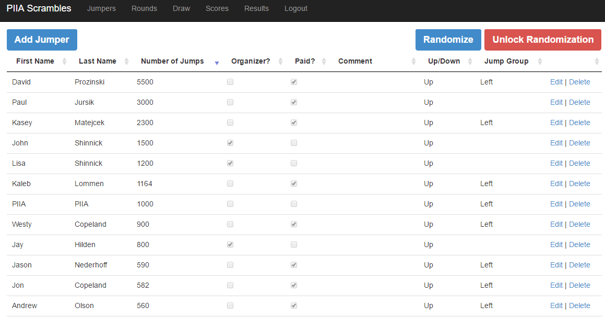
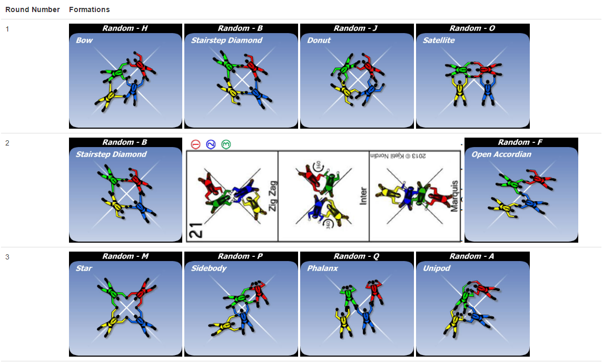
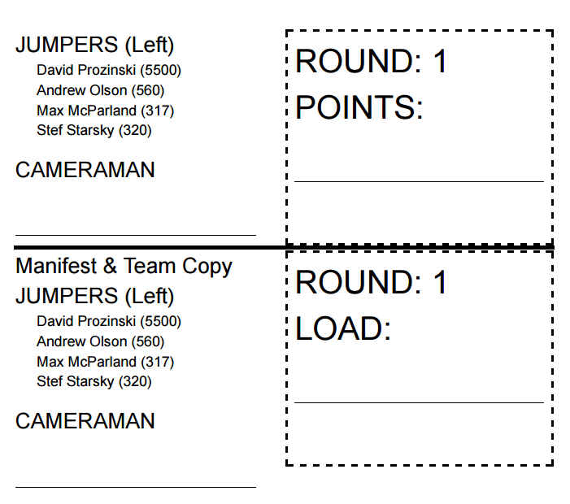
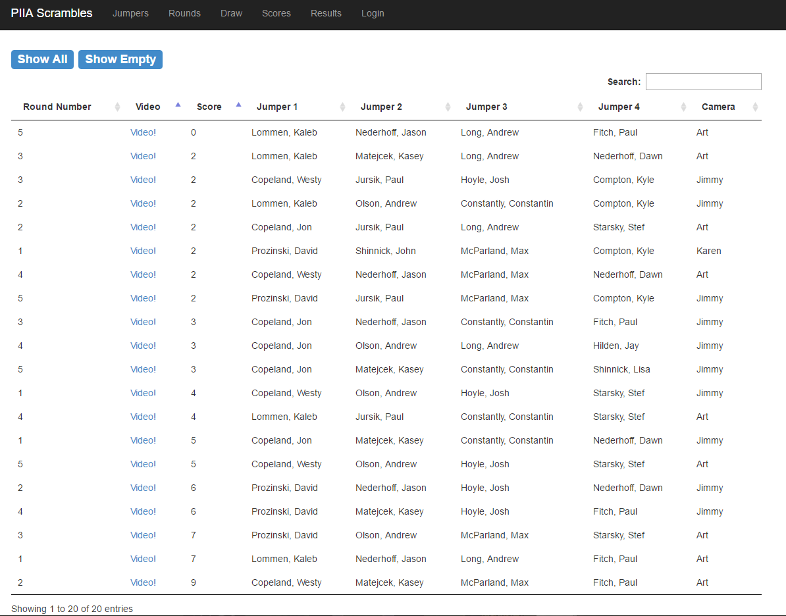
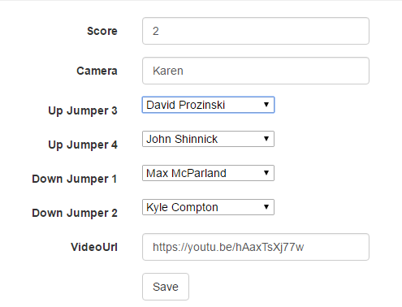
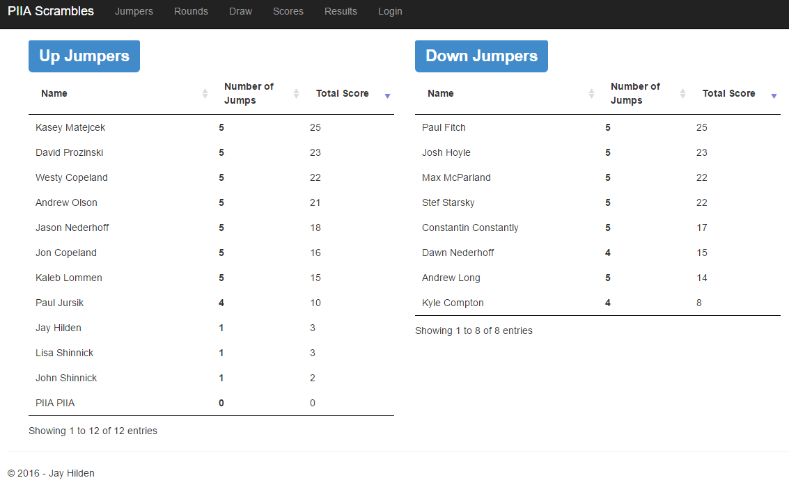
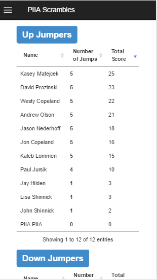
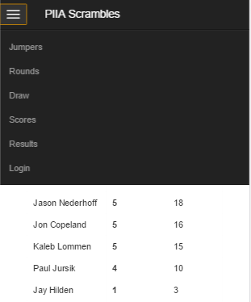

# Latest Live Site [skydive.hilden.io](http://skydive.hilden.io)

# You can use this project to create a Skydiving Scrambles event.
- Enter in a list of jumpers
- Randomize the jumpers into groups of 2 experiences and 2 newer jumpers
- Track scores
- Link to the videos

# Add Jumpers

# Create a Draw

# Print the Draw for Manifest and the Camera Person
When you print the draw it automatically prints one per page.  
Each page can be split in half, one half for manifest, one half for the camera person.

# View Scores

# Admins Can Enter Scores
When entering scores you can add:
- Round Scores
- Camera person
- Link to the videos

You can also edit the jumpers.  This is very useful because often a jumper may drop out or a sub is required.  Using this tool you can manage all that on the fly!

# View Results

# Realtime Results On Mobile
The scrambles participants love to view their scores in real time.  With this site they can, just send them a link to the results screen and it will automatically be responsive on their mobile device.

# Menu Support on Mobile

